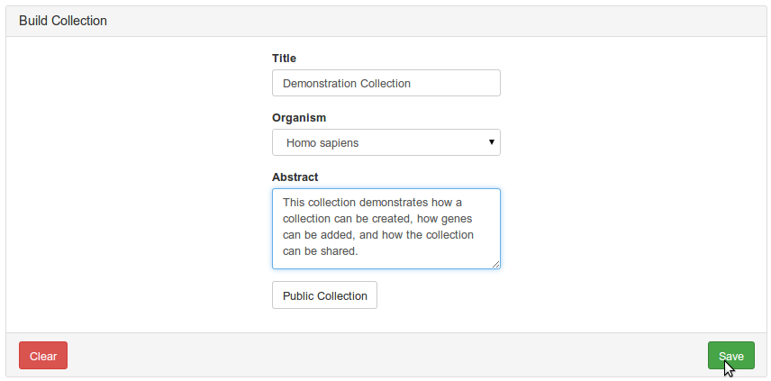
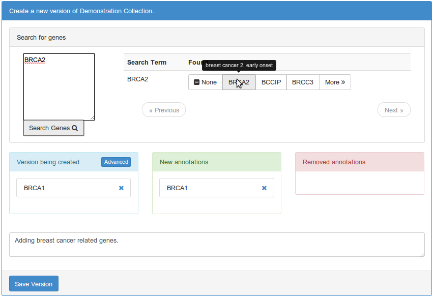
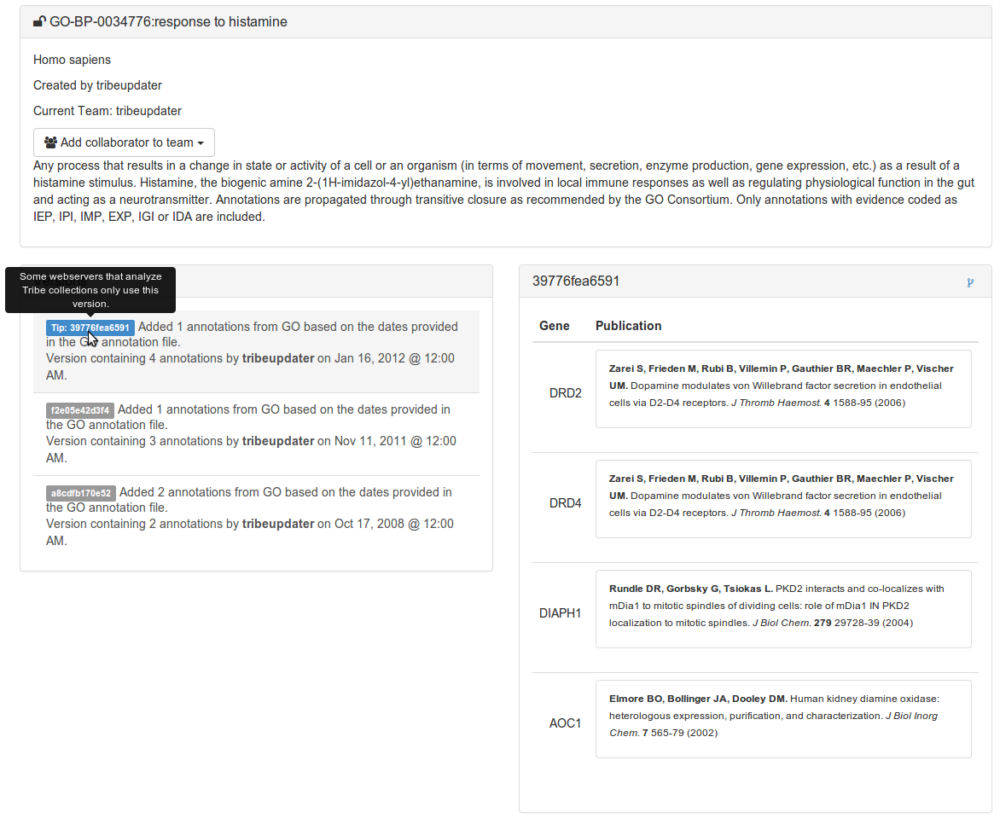
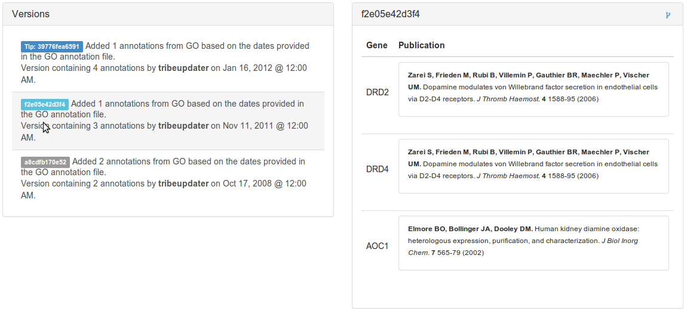
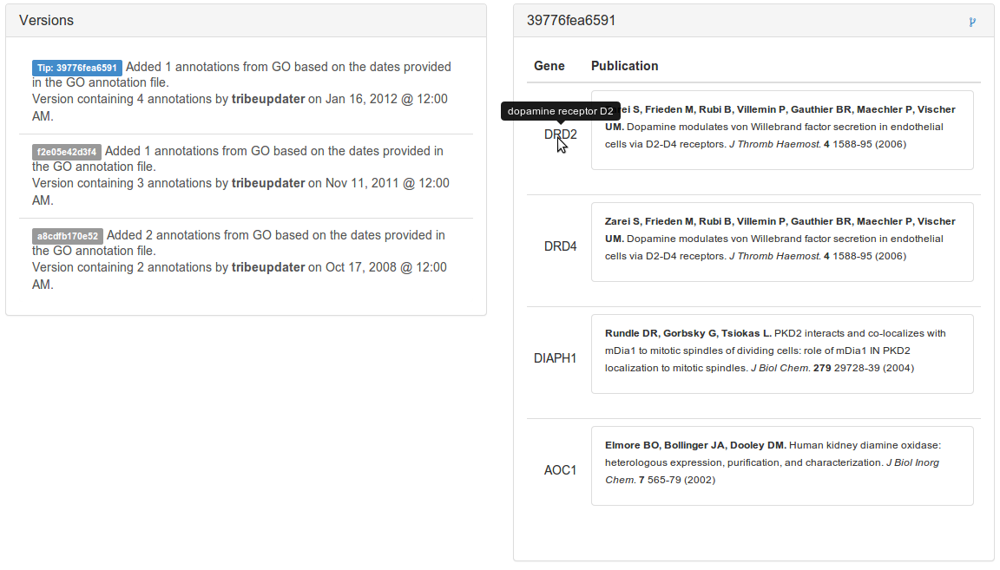
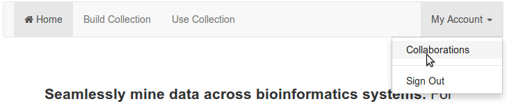
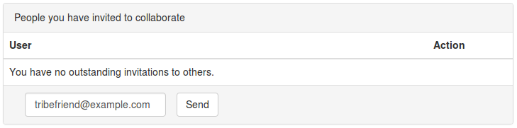
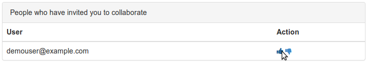

Tribe's web interface
=========================

You can navigate Tribe's web interface by directing your browser to: https://tribe.greenelab.com/#/home

.. _creating_collections_web_interface:

Creating collections and keeping your history
----------------------------------------------------

Create a new collection that you'd like to share
____________________________________________________

|
|

Add some initial information to your collection
__________________________________________________

|
|

When you load a collection detail page, the most recent version ("Tip") is shown.
____________________________________________________________________________________

|
|

You can step back in time with the collection by selecting any prior version.
_______________________________________________________________________________

|
|

When the user provides literature support for the annotation, Tribe displays the publication.
_______________________________________________________________________________________________

|
|
|

Collaborating with others using Tribe
-----------------------------------------

Share collections by collaborating
_____________________________________

|
|

Invite users to collaborate by email address
______________________________________________

|
|

Once they accept your invitation, you can share collections
_____________________________________________________________

|
|